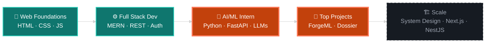

<!-- ═══════════════ HEADER ═══════════════ -->
<div align="center">


<a href="https://github.com/DevAnas19">
  
</a>

<br/>


<br/><br/>

<a href="https://www.linkedin.com/in/anas-ansari-66678b378"></a>
<a href="https://github.com/DevAnas19?tab=repositories"></a>
<a href="https://symphonious-gecko-dbe753.netlify.app"></a>

</div>


<!-- ═══════════════ ABOUT ═══════════════ -->
<div align="center">
  
</div>

```js
const anas = {
  now:        "AI/ML Intern",
  before:     "Full Stack Developer",
  roots:      ["MongoDB", "Express", "React", "Node.js"],
  alsoWrites: ["Python", "FastAPI", "PostgreSQL"],
  secures:    ["JWT", "bcrypt", "Cookies", "Sessions"],
  exploring:  ["LLM agents", "ML pipelines", "Explainable AI"],
  mission:    "Build scalable products that real people actually use",
  philosophy: "Projects first. Tutorials second.",
  status:     "🟢 building something right now",
};
```

<!-- ═══════════════ EXPERIENCE ═══════════════ -->
<div align="center">
  
</div>

<table align="center">
  <tr>
    <td align="center" width="50%" valign="top">
      
      <br/><br/>
      <b>AI / ML Intern</b><br/>
      <sub>Building LLM-powered APIs and ML systems with Python, FastAPI, RAG and function-calling pipelines.</sub>
      <br/><br/>
      
    </td>
    <td align="center" width="50%" valign="top">
      
      <br/><br/>
      <b>Full Stack Developer</b><br/>
      <sub>Shipped admin panels, secure auth flows and REST APIs across the MERN stack and PostgreSQL.</sub>
      <br/><br/>
      
    </td>
  </tr>
</table>

<!-- ═══════════════ STACK ═══════════════ -->
<div align="center">
  
</div>

<div align="center">

**AI / ML & Backend**<br/>


**Frontend**<br/>


**Databases**<br/>


**Tools & Deploy**<br/>


</div>


<!-- ═══════════════ PROJECTS ═══════════════ -->
<div align="center">
  
</div>

<table align="center">

  <!-- ForgeML -->
  <tr>
    <td align="center" valign="middle" width="45%">
      <a href="https://github.com/DevAnas19/Forge_ML">
        
      </a>
    </td>
    <td valign="middle" width="55%">
      <h3>
        ⚒️ ForgeML
        
      </h3>
      <sub>
        A full-stack ML experimentation and deployment platform — upload and
        profile datasets, validate data, train and compare multiple models,
        track experiments, manage a versioned model registry, serve predictions,
        explain models with <b>SHAP</b>, and use an LLM assistant for experiment
        planning and analysis.
      </sub>
      <br/><br/>
      
      <br/><br/>
      <a href="https://forge-ml-gamma.vercel.app">
        
      </a>
      <a href="https://github.com/DevAnas19/Forge_ML">
        
      </a>
      <a href="https://forge-ml.onrender.com/docs">
        
      </a>
    </td>
  </tr>
  <!-- Dossier -->
  <tr>
    <td align="center" valign="middle">
      <a href="https://github.com/DevAnas19/Dossier">
        
      </a>
    </td>
    <td valign="middle">
      <h3>
        🕵️ Dossier
        
      </h3>
      <sub>
        A multi-agent research pipeline: a <b>search agent</b> finds sources,
        a <b>reader</b> scrapes them, a <b>writer</b> drafts the report and a
        <b>critic</b> reviews it. Powered by LangChain / LangGraph, Tavily and
        Groq-hosted LLMs, with a FastAPI + React interface.
      </sub>
      <br/><br/>
      
    </td>
  </tr>

  <!-- Escape Realm -->
  <tr>
    <td align="center" valign="middle">
      <a href="https://github.com/DevAnas19/EscapeRealm">
        
      </a>
    </td>
    <td valign="middle">
      <h3>
        🎮 Escape Realm
        
      </h3>
      <sub>
        A 2D adventure game with a complete backend — register, log in with
        <b>JWT</b>, and save your progress to <b>PostgreSQL</b>.
      </sub>
      <br/><br/>
      <a href="https://symphonious-gecko-dbe753.netlify.app">
        
      </a>
      <a href="https://github.com/DevAnas19/EscapeRealm">
        
      </a>
      <br/><br/>
      
    </td>
  </tr>

</table>

<div align="center">
  <sub>
    Also built:
    <a href="https://admin-page-nu-six.vercel.app">Admin Dashboard Template</a>
    ·
    <a href="https://github.com/DevAnas19/admintemp1">source</a>
  </sub>
</div>
```

<!-- ═══════════════ JOURNEY ═══════════════ -->
<div align="center">
  
</div>



<div align="center"><sub>✅ done &nbsp;·&nbsp; 🟠 in progress &nbsp;·&nbsp; ⬜ up next</sub></div>


<!-- ═══════════════ STATS ═══════════════ -->
<div align="center">
  
</div>

<div align="center">


<br/>


<br/><br/>


<br/>


</div>

<br/>

<!-- ═══════════════ CLOSING ═══════════════ -->
<div align="center">


<br/>

<a href="https://www.linkedin.com/in/anas-ansari-66678b378"></a>

<sub>⭐ If something here inspired you, star a repo — it genuinely makes my day.</sub>

</div>


